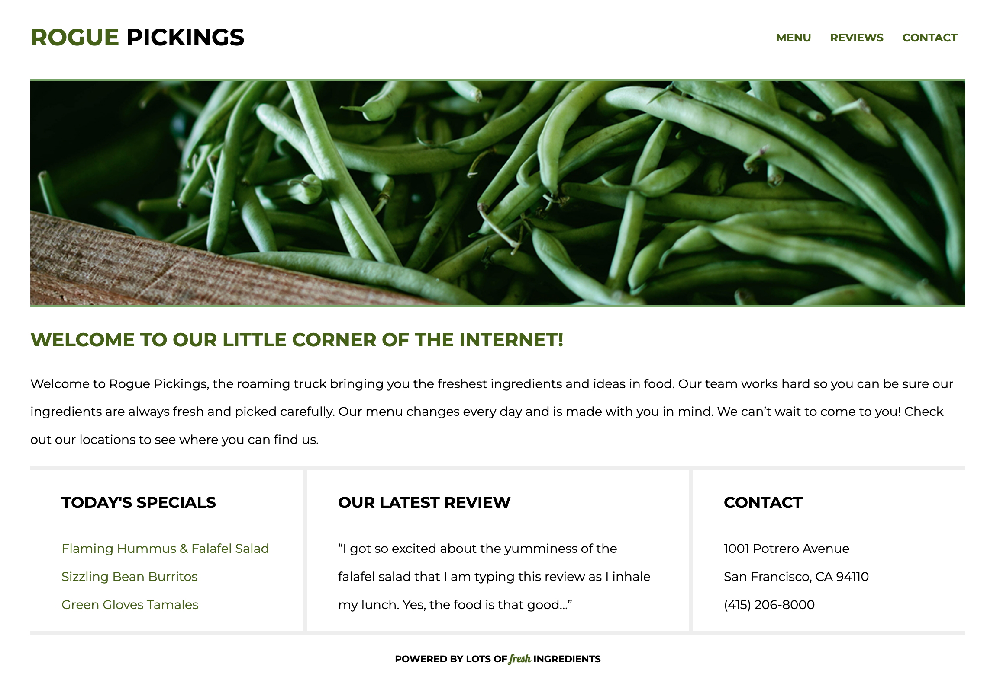

# Rogue Pickings

## Description
Rogue Pickings is a simple, single-page website for a fictional food truck business. The website is designed to be clean and easy to navigate, providing essential information to visitors. It features a menu section showcasing today's specials, a reviews section with the latest customer feedback, and a contact section with the business's address and phone number.



## Features
+ Responsive design that works on desktop, tablets, and mobiles
+ Google Fonts integration for beautiful typography
+ Clean and easy-to-understand code

## Installation
To get the site up and running on your local machine, follow these steps:

1. Clone the repository:<br>
`git clone https://github.com/your-username/rogue-pickings.git`
1. Navigate to the project directory:<br>
`cd rogue-pickings`
1. Open the HTML file in your browser:<br>
`open index.html`<br>
or simply double-click on the index.html file in your file manager to open it in your default web browser.

## File Structure
```
rogue-pickings/
│
├── css/
│   ├── normalize.css
│   └── main.css
│
├── img/
│   └── green-bean.jpg
│
└── index.html
```

## Technologies Used


## Credits
This project was created by [Skillcrush](https://skillcrush.com/) - The online coding & design school with a :heart:	

Live Project Link: [Rogue Pickings](https://christopherjack.github.io/rogue-pickings/) on GitHub
